# 🔗 QuickBizCalc: Strategic Backlink Building Roadmap

To rank a new domain (DA 0) for highly competitive keywords like "payroll calculator" or "overtime calculator," you must build **Domain Authority (DA)**. Since your site offers interactive utility tools, you have a massive advantage over standard blogs: **people love linking to free tools.**

Here is your phase-by-phase roadmap to build high-quality, passive, and active backlinks.

---

## Phase 1: Foundations & The "Embed Code" Growth Hack (Month 1)
Instead of just asking for links, give people a reason to feature your calculator.

### 🛠️ The Calculator Embed Strategy
You already have `/calculators/[slug]/embed` routes. Now you need to make them visible and easy to copy.
* **Action:** At the bottom of each calculator (or in the sidebar), add a small, styled card:
  > **"Want to feature this calculator on your website?"**
  > [ Copy Embed Code HTML ]
* **Backlink anchor:** Ensure the iframe embed code includes a clean, follow-backlink pointing to the homepage:
  ```html
  <iframe src="https://www.quickbizcalc.com/calculators/hourly-paycheck-calculator/embed" width="100%" height="600" style="border:none;"></iframe>
  <p style="text-align:right; font-size:12px;">Powered by <a href="https://www.quickbizcalc.com" target="_blank">QuickBizCalc</a></p>
  ```
* *Why this works:* HR blogs, financial advisors, and small business resource sites will embed your tools to make their articles more engaging. This builds thousands of contextual, high-authority backlinks automatically.

---

## Phase 2: High-Volume Directories & Listings (Month 1-2)
Submit your site to free, reputable business and web directories to build initial search engine trust.

* **Product Directory Listings:**
  * **Product Hunt** (Launch as a free suite of small business calculators).
  * **BetaList / StartupBase** (Great for getting early indexation and follow links).
  * **AlternativeTo** (List QuickBizCalc as a free alternative to premium software like QuickBooks Paycheck Tool).
* **Business Directory Listings:**
  * **Crunchbase** (Build a free company profile).
  * **Clutch.co / G2** (If listing as a service or business tool provider).

---

## Phase 3: Targeted Outreach & Digital PR (Months 2-4)
Identify existing content on the web that would benefit from your tools.

### 1. The "Resource Page" Link Building Strategy
Many university career offices, local chamber of commerce pages, and business development centers have "Resource" or "Tools" lists for local business owners.
* **Prospecting Search Operators:**
  * `intitle:"business resources" "calculators"`
  * `inurl:resources "payroll calculator"`
  * `site:.edu "financial tools"`
* **Action:** Send a short, personalized email offering your clean, ad-free calculators as a free resource to add to their lists.

### 2. Broken Link Building
Find high-authority business blogs or old HR resources containing links to calculators that are now offline or broken (404).
* **Action:** Use free chrome extensions (like *Check My Links*) or SEO tools to find broken links on older resource articles, then email the webmaster suggesting QuickBizCalc as a replacement.

---

## Phase 4: Content Collaboration & Guest Posting (Months 3-6)
Write articles for other websites in exchange for a contextual link to your calculators.

* **Affiliate & Partner Sites:** Reach out to B2B platforms, payroll companies, or time-tracking software blogs (e.g. Clockify, Toggl, smaller payroll agencies).
* **Topics to Pitch:**
  * *"How to minimize payroll tax errors for remote employees"* (Link to your `/calculators/payroll-calculator`).
  * *"The true cost of employee turnover in 2026"* (Link to `/calculators/employee-turnover-calculator`).
  * *"5 steps to structure sales commissions for early-stage startups"* (Link to `/calculators/commission-calculator`).

---

## Summary Timeline of Goals

```mermaid
gantt
    title Backlink Building Timeline
    dateFormat  X
    axisFormat %d
    section Phase 1
    Embed Code Integration & Setup :active, 0, 30
    section Phase 2
    Directory & Listing Submissions : 15, 45
    section Phase 3
    Resource Pages & Digital PR : 30, 90
    section Phase 4
    Guest Blogging & Partnerships : 60, 120
```


